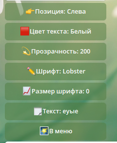

<h1 align="center">
   
  
   
    Wtrmarkbot
   
</h1>

<h4 align="center">Wtrmarkbot - это небольшой Telegram бот, который позволяет без особых усилий накладывать текст-вотермарку на картинку.</h4>

  

## Возможности
* Накладывание текста на картинку (внезапно!)
* Возможность выбора шрифтов
* Возможность выбора цвета текста, его размера и прозрачности
* Возможность выбора позиции, где нужно разместить текст
* 2 вида работы - через сохранённые настройки и через пошаговый выбор.

## Скриншоты
* Настройки:

* Меню выбора типа работы:

